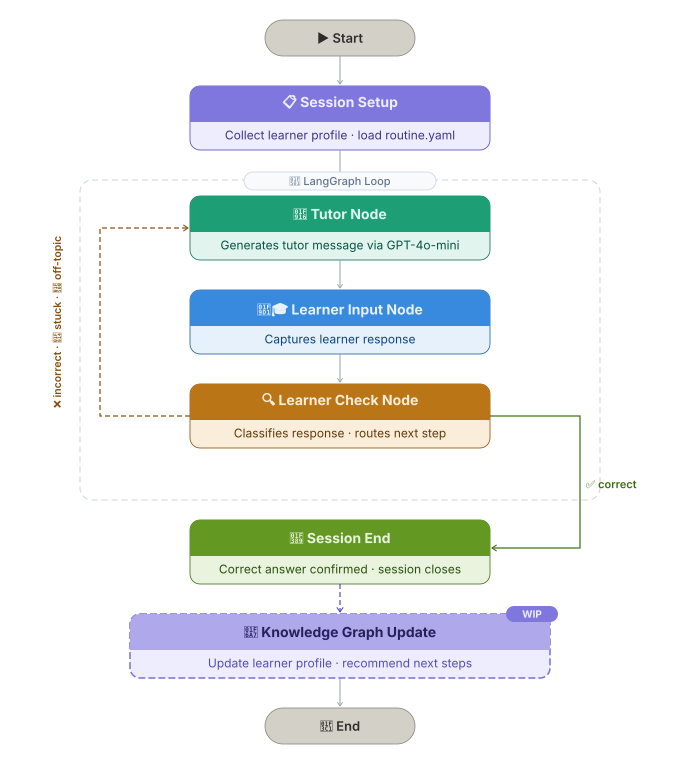

# XRP-Primer-Kit | Adaptive AI Tutoring Routine Prototype

This repository contains an early terminal-based prototype of an adaptive tutoring agent built with **LangGraph**, a **YAML-defined tutoring routine**, and two LLM calls: one for generating tutor messages and one for classifying learner responses.

The goal of this prototype is to explore how an AI tutor can guide a learner through an exercise without immediately giving away the answer. The system collects learner context, follows a routine defined in `routine.yaml`, routes through a LangGraph state machine, and adapts its next response based on whether the learner is correct, incorrect, stuck, or off-topic.

This repo should be treated as the **prototype / proof-of-concept version** of the work. The continued implementation work is now happening in:

[Allogy/the-primer](https://github.com/Allogy/the-primer)

---

## Project Status

This repository represents the first working version of the adaptive tutoring routine.

The currently testable runtime is:

```text
src/routine_graph.py
src/routine.yaml
```

The file:

```text
src/routine_v2.yaml
```

is included as a **design artifact** for a more flexible future routine. It is useful for documenting the next direction of the tutoring flow, but it should not be treated as the fully runnable or fully tested runtime path.

In other words:

- `routine.yaml` is the current runnable routine.
- `routine_graph.py` is the current executable LangGraph prototype.
- `routine_v2.yaml` is a non-runnable design artifact for future iteration.
- `Allogy/the-primer` is the continuation of this work in a more structured codebase.

---

## Pipeline Overview



At a high level, the system works like this:

```text
Learner Profile + routine.yaml
        ↓
Initialize TutorState
        ↓
route_next_node
        ↓
Run the node matching the current YAML step type
        ↓
Update current_step_id
        ↓
Return to route_next_node
        ↓
Repeat until current_step_id == "end"
        ↓
Update Learner Profile at the end of the session
```

The most important idea is that **`routine.yaml` defines the tutoring flow**, while **`routine_graph.py` executes that flow through LangGraph**.

---

## What This Prototype Does

The current prototype supports:

- collecting learner information from the terminal
- loading a YAML-defined tutoring routine
- generating tutor responses with an LLM
- collecting learner responses interactively
- classifying learner responses as `correct`, `incorrect`, `stuck`, or `off_topic`
- routing to the next tutoring step based on the classification
- maintaining a lightweight conversation history
- ending the session when the YAML routine reaches the `end` step
- testing the YAML routing and LangGraph node behavior without live LLM calls

The tutor is designed to act like a second instructor: it gives hints, scaffolds, redirects, and reinforces learning while avoiding direct final-answer reveals.

---

## Repository Structure

```text
.
├── README.md
├── pyproject.toml
├── uv.lock
├── docs/
│   └── tutor_pipeline_flowchart.svg
├── src/
│   ├── __init__.py
│   ├── routine_graph.py
│   ├── routine.yaml
│   └── routine_v2.yaml
└── tests/
    └── test_adaptive_tutoring_prototype.py
```

---

## Core Files

### `src/routine_graph.py`

This file contains the executable LangGraph workflow.

Important components:

| Component | Purpose |
|---|---|
| `TutorState` | Stores the learner profile, current step, messages, selected route, and conversation history. |
| `load_routine()` | Loads the YAML routine from `routine.yaml`. |
| `get_current_step()` | Finds the YAML step matching the current `current_step_id`. |
| `route_next_node()` | Reads `current_step_id`, checks the step type, and decides which LangGraph node runs next. |
| `tutor_node()` | Generates a tutor message for a `tutor_message` step and advances to `step.next`. |
| `learner_input_node()` | Collects the learner’s terminal response and advances to `step.next`. |
| `learner_check_node()` | Classifies the learner response and selects the next step from the YAML `routes`. |
| `build_graph()` | Builds and compiles the LangGraph state machine. |
| `run_interactive_session()` | Collects initial learner inputs and starts the tutoring session. |

### `src/routine.yaml`

This file defines the current runnable tutoring routine and teaching policy.

It includes:

- session goals and duration assumptions
- required and optional learner inputs
- teaching constraints
- conceptual knowledge-graph goals
- exercise-generation goals
- response classification labels
- YAML flow steps
- route behavior after learner evaluation
- future learner-state update goals

The current runnable flow starts at:

```yaml
start_step: present_exercise
```

Then proceeds through this loop:

```text
present_exercise
        ↓
wait_for_learner_response
        ↓
evaluate_response
        ↓
correct      → correct_feedback → another_exercise
incorrect    → targeted_hint    → wait_for_learner_response
stuck        → scaffold         → wait_for_learner_response
off_topic    → redirect         → wait_for_learner_response
```

The continuation flow then asks whether the learner wants another exercise:

```text
another_exercise
        ↓
check_another_exercise
        ↓
yes      → present_exercise
no       → end
unclear  → another_exercise
```

### `src/routine_v2.yaml`

This file is a design artifact for a more flexible future tutoring routine.

It should be read as a planning document for the next version of the system, not as the current tested runtime. The current tests only verify that this file parses as valid YAML. The executable behavior is still centered on `routine_graph.py` and `routine.yaml`.

---

## How the Runtime Loop Works

The LangGraph workflow is controlled by `current_step_id`.

1. `run_interactive_session()` collects learner information.
2. `routine.yaml` is loaded into the initial `TutorState`.
3. `current_step_id` is set to the YAML `start_step`, which is currently `present_exercise`.
4. `route_next_node()` checks the current YAML step.
5. Depending on the YAML step type, the graph runs one of three nodes:

```text
tutor_message  → tutor_node
learner_input  → learner_input_node
learner_check  → learner_check_node
```

6. Each node returns a partial state update.
7. The updated `current_step_id` determines the next step.
8. LangGraph returns to `route_next_node()`.
9. The session repeats until `current_step_id == "end"`.

---

## Response Routing

The evaluator classifies the learner’s latest response into one of four labels:

| Label | Meaning | Next Behavior |
|---|---|---|
| `correct` | The learner answered the exercise correctly. | Give brief positive feedback, then offer another exercise. |
| `incorrect` | The learner attempted an answer but made an error. | Give one targeted hint and ask them to try again. |
| `stuck` | The learner is unsure, asks for help, or gives no substantive answer. | Scaffold with a simpler diagnostic question. |
| `off_topic` | The learner’s response is unrelated to the exercise. | Redirect the learner back to the current exercise. |

These labels are not hardcoded as final destinations in the Python graph. Instead, `learner_check_node()` reads the route map from `routine.yaml`:

```yaml
routes:
  correct: correct_feedback
  incorrect: targeted_hint
  stuck: scaffold
  off_topic: redirect
```

This keeps the tutoring policy easier to change without rewriting the graph logic.

---

## Example Session

When the program starts, it asks for:

```text
Name:
Session goals:
Difficulty level:
Current level:
Learning preferences:
Target concepts, separated by commas:
```

Example input:

```text
Name: Joseph
Session goals: Practice solving one-step equations
Difficulty level: beginner
Current level: understands variables but struggles with inverse operations
Learning preferences: hints before explanations
Target concepts, separated by commas: variables, equations, inverse operations
```

The tutor then generates an exercise, waits for the learner’s answer, classifies the response, and routes to the next YAML step.

---

## Running the Prototype

Install dependencies with `uv`:

```bash
uv sync
```

Run the interactive prototype:

```bash
uv run python src/routine_graph.py
```

The prototype expects the relevant LLM API key configuration to be available in your local environment.

---

## Running Tests

The tests are designed to validate the prototype behavior without making live LLM calls.

Run:

```bash
uv run pytest -v
```

The current tests cover:

- loading the runnable routine
- validating YAML step references
- checking route targets and fallback routes
- confirming that `routine_v2.yaml` parses as a design artifact
- testing route selection for tutor, learner input, learner check, and end states
- monkeypatching fake tutor/classifier models
- checking that the LangGraph workflow compiles

---

## Design Principles

### YAML-defined tutoring logic

The routine is stored in `routine.yaml` so that prompts, transitions, and route behavior can be edited without changing the LangGraph implementation.

### State-based graph execution

The graph does not manually call steps in a fixed order. Instead, it repeatedly checks `current_step_id`, finds the matching YAML step, and routes to the correct node type.

### Separate tutor and classifier calls

The system uses two LLM configurations:

- a tutor model with a larger token budget for student-facing responses
- a classifier model with a small token budget for route labels

This separates the teaching behavior from the routing/evaluation behavior.

### Hint-based tutoring

The tutor is constrained to guide without giving away final answers. It should ask questions, provide targeted hints, and scaffold the learner toward the next step.

---

## Relationship to `Allogy/the-primer`

This repository is the earlier XRP Primer Kit prototype.

The continuation of this work is now happening in:

[Allogy/the-primer](https://github.com/Allogy/the-primer)

That repository is intended to be the more structured implementation path, with a cleaner project layout and a broader YAML-driven tutoring engine. This repo remains useful as a compact prototype showing the original LangGraph routine loop and routing logic.

---

## Current Limitations

This is an early prototype. Some parts of the larger pipeline are currently conceptual rather than fully implemented.

Current limitations include:

- the knowledge graph is described in `routine.yaml` but not yet implemented as a persistent data structure
- learner state is not saved across sessions
- evaluation metrics are specified conceptually but not logged automatically
- the interface is terminal-based
- `routine_v2.yaml` is not a tested executable routine
- live tutor behavior still depends on external LLM configuration
- this repo is not the main continuation repo for the project

---

## Future Improvements

Planned extensions include will all be in the following repository: `Allogy/the-primer`

---

## License

MIT License.